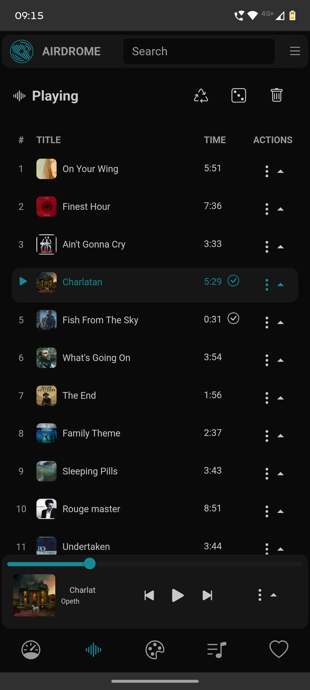
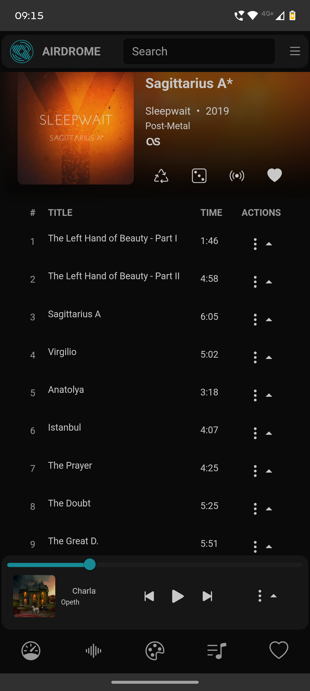
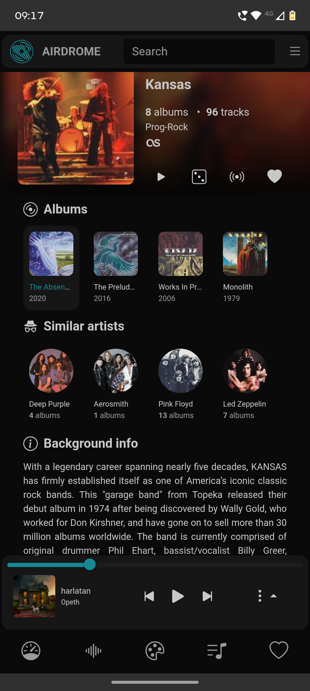
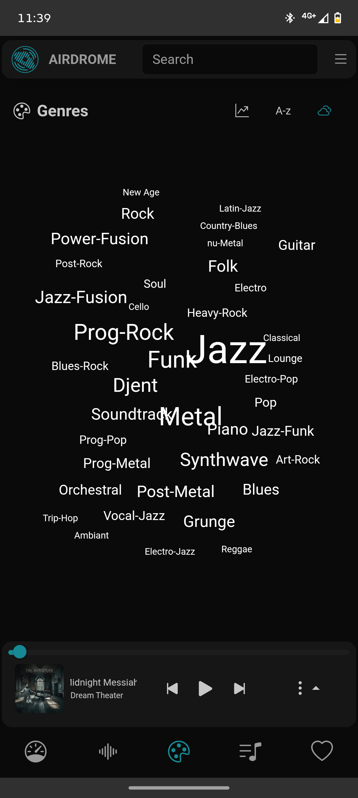
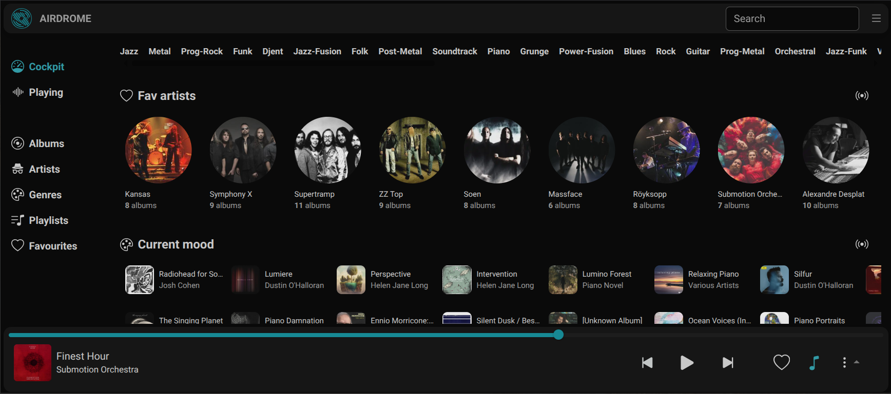

# Airdrome Music Player


Airdrome is a powerful modern application for Android and Desktop, supporting [navidrome](https://github.com/navidrome/navidrome), [airsonic-advanced](https://github.com/airsonic-advanced/airsonic-advanced), [NextCloud Music](https://apps.nextcloud.com/apps/music) and other [subsonic](https://github.com/topics/subsonic) compatible music servers.

## Features
- "Cockpit" library home page with playback suggestions based on recent listenings
- Library browsing for albums, artist, genres, playlists, favourites
- "Radio like" dynamic playlists for anything : Genre, Album, Artist, Recent albums, Favourites, Random
- 3 "CD quality" OPUS transcoding modes
- Native Gapless playback
- 2 modes Replay Gain support
- Full mediaSession integration
- Persistent queue, repeat, shuffle
- 4 color themes
- Responsive UI for Android, and WEB browser (standard page or PWA)
- Persistant cache and download for offline listening
- View, create, and edit playlists
- Full text search with sorted results by artists, albums, tracks
- Favourites tagging

## Screenshots

      



## Run from Docker Hub

```
$ docker run -d \
  --name=airdrome \
  --restart on-failure \
  --network=bridge \
  -p 8080:80 \
  h7p3ri0n/airdrome:latest

```

## Build your own Docker image

```
$ yarn install
$ yarn build
```

Bundle can be found in the `dist` folder.

Build docker image:

```
$ docker build -f docker/Dockerfile -t local/airdrome .

$ docker run -d \
  --name=airdrome \
  --restart on-failure \
  --network=bridge \
  -p 8080:80 \
  local/airdrome:latest

```

## OpenSubsonic endpoints

- getAlbumList2
- getArtistInfo2
- getAlbumInfo2
- getStarred2
- search3
- getSongsByGenre
- getRandomSongs
- getPlayQueue
- savePlayQueue
- getScanStatus
- startScan
- getOpenSubsonicExtensions

## Contributors

- [chunjiw](https://github.com/chunjiw) — Capacitor-based Android build

## License

Licensed under the [AGPLv3](LICENSE) license.
