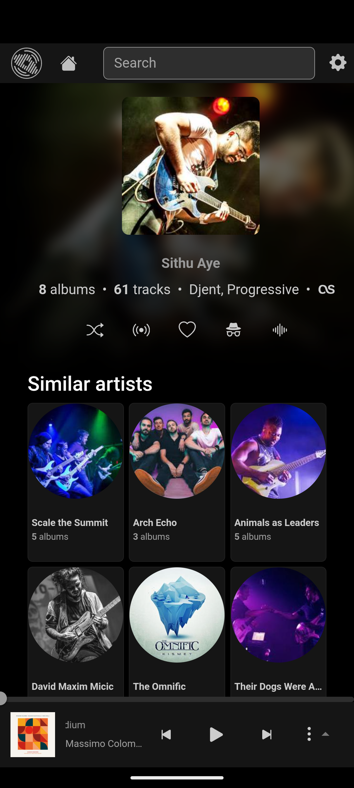

# Airdrome Web UI

Airdrome is a fork of Airsonic (refix) UI (https://github.com/tamland/airsonic-refix)

A modern responsive web frontend for [navidrome](https://github.com/navidrome/navidrome), [airsonic-advanced](https://github.com/airsonic-advanced/airsonic-advanced), 
[gonic](https://github.com/sentriz/gonic) and other [subsonic](https://github.com/topics/subsonic) compatible music servers.

## Features
- Responsive UI for desktop and mobile
- Browse library for albums, artist, generes
- Playback with persistent queue, repeat & shuffle
- MediaSession integration
- View, create, and edit playlists with drag and drop
- Built-in 'random' playlist
- Search
- Favourites
- Internet radio
- Podcasts

## [Live demo](https://darkstar.zenwalk.org)

Enter the URL and credentials for your subsonic compatible server, or use one of the following public demo servers:

**Subsonic**  
  Server: `https://airsonic.netlify.app/api`  
  Username: `guest4`, `guest5`, `guest6` etc.  
  Password:`guest`

**Navidrome**  
  Server: `https://demo.navidrome.org`  
  Username: `demo`  
  Password:`demo`


**Note**: if the server is using http only you must allow mixed content in your browser otherwise login will not work.

## Screenshots





## Install

```
$ yarn install
$ yarn build
```

Bundle can be found in the `dist` folder.

Build docker image:

```
$ docker build -f docker/Dockerfile -t local/airdrome .

$ docker run -d \
	--name=airdrome \
	--restart on-failure \
	--network=bridge \
	-p 8080:80 \
	local/airdrome:latest

```

## OpenSubsonic support

- HTTP form POST extension
- Multiple artists/genres

## License

Licensed under the [AGPLv3](LICENSE) license.
