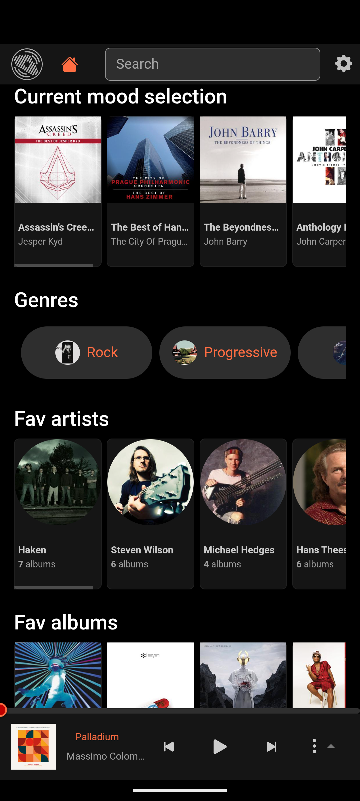
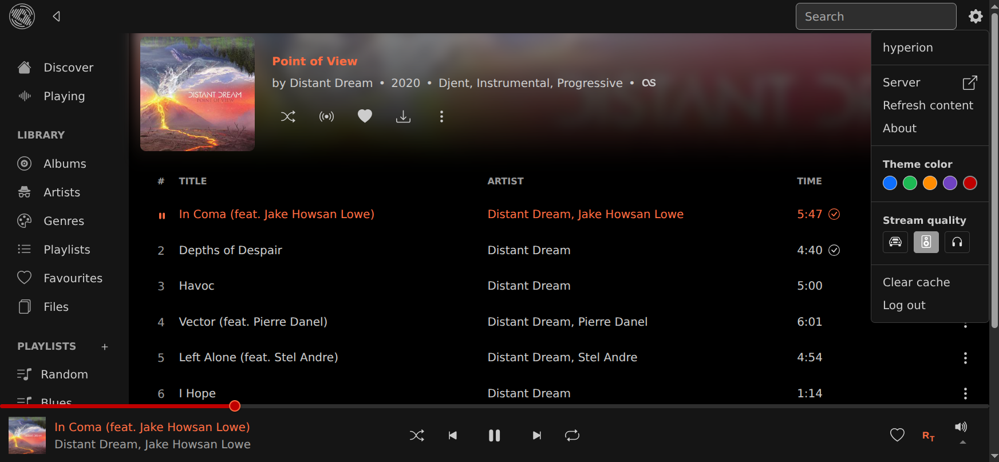

# Airdrome Music Player


Airdrome is a modern responsive web frontend for [navidrome](https://github.com/navidrome/navidrome), [airsonic-advanced](https://github.com/airsonic-advanced/airsonic-advanced), [NextCloud Music](https://apps.nextcloud.com/apps/music) and other [subsonic](https://github.com/topics/subsonic) compatible music servers.

## Features
- Discover Home page with playback suggestions based on recent listenings
- 3 high quality codec transcoding modes : FLAC / OPUS 192 / OPUS 128
- Gapless playback, with persistent queue, repeat, shuffle and Replay-Gain
- 4 color themes
- "Radio like" dynamic playlists for Genre, Album, Artist
- Responsive UI for desktop and mobile, will work on any browser
- Library browsing for albums, artist, genres, playlists, favourites
- Persistant cache and download for offline listening
- Full mediaSession integration
- View, create, and edit playlists
- Full text search
- Favourites tagging

## Screenshots

      



## Install

```
$ yarn install
$ yarn build
```

Bundle can be found in the `dist` folder.

Build docker image:

```
$ docker build -f docker/Dockerfile -t local/airdrome .

$ docker run -d \
  --name=airdrome \
  --restart on-failure \
  --network=bridge \
  -p 8080:80 \
  local/airdrome:latest

```

## OpenSubsonic endpoints

- getAlbumList2
- getArtistInfo2
- getAlbumInfo2
- getStarred2
- search3
- getSongsByGenre
- getRandomSongs
- getPlayQueue
- savePlayQueue
- getScanStatus
- startScan
- getOpenSubsonicExtensions

## License

Licensed under the [AGPLv3](LICENSE) license.
