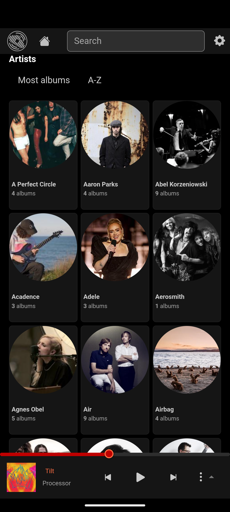
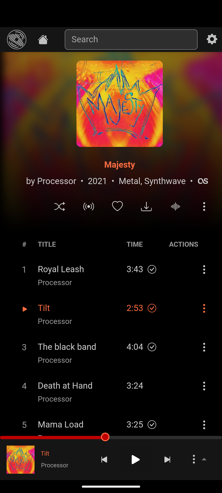

# Airdrome Web UI


Airdrome is a fork of Airsonic (refix) UI (https://github.com/tamland/airsonic-refix)

A modern responsive web frontend for [navidrome](https://github.com/navidrome/navidrome), [airsonic-advanced](https://github.com/airsonic-advanced/airsonic-advanced), 
[gonic](https://github.com/sentriz/gonic) and other [subsonic](https://github.com/topics/subsonic) compatible music servers.

## Features
- Discover Home page with playback suggestions based on recent listenings
- Responsive UI for desktop and mobile
- Browse library for albums, artist, genres
- Gapless playback
- Playback with persistent queue, repeat, shuffle and Replay-Gain
- Persistant cache and download for offline listening
- Codec quality control
- Full mediaSession integration
- View, create, and edit playlists with drag and drop
- Dynamic playlists for Genre, albums and Artist
- 4 color themes
- Search
- Favourites

## Screenshots

      


## Install

```
$ yarn install
$ yarn build
```

Bundle can be found in the `dist` folder.

Build docker image:

```
$ docker build -f docker/Dockerfile -t local/airdrome .

$ docker run -d \
	--name=airdrome \
	--restart on-failure \
	--network=bridge \
	-p 8080:80 \
	local/airdrome:latest

```

## OpenSubsonic support

- HTTP form POST extension
- Multiple artists/genres

## License

Licensed under the [AGPLv3](LICENSE) license.
